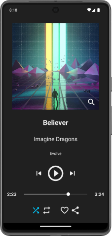

# Doramify
Doramify is an Android music player app. It offers the basics of any music player: change songs, shuffle, repeat...

It was built in Kotlin using Android Studio.

> [!NOTE]  
> This app was made when I was a student and had a tight deadline, so don't expect quality code. 

# Images

